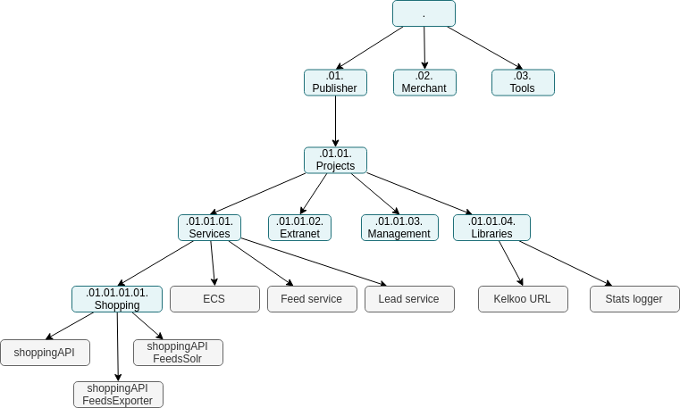

```thegardener
{
  "page" :
     {
        "label": "Configure theGardener",
        "description": "How to configure a new instance of theGardener ?"
     }
}
```

theGardener is an application that gather documentation from projects hosted on git repositories. 
This application need to be installed and configured. 


The main configuration steps are :

- define the hierarchy
- register projects hosted on a git repository
- make the links between the projects and the hierarchy
- define hooks on git servers to trigger theGardener synchronisation
- some UI settings


## Hierarchy and projects




The hierarchy consist on a tree that can be as fat and as deep as needed. 
For a better user experience we advise to have 
- less than 8 nodes on the first level
- less that 5 levels 

The list of project can be as long as needed. The limit is the disk size to store the different project sources in the database and on the file system.

Once the hierarchy and the projects are registered, we need to associate the project to the nodes of the hierarchy. One given project can be attached to several nodes if needed.    

The first level of the hierarchy will be displayed on the header of the application. 
Once a first level node is selected, the sub tree will be displayed on the left menu.

**DISCLAIMER**: this procedure help to configure the application theGardener. This procedure will be replaced by a proper UI: the goal of the milestone [M3 Administration](https://github.com/KelkooGroup/theGardener/milestone/2) is to provide an easy way to configure the application.


### Hierarchy

Define hierarchy:

```thegardener
{
  "scenarios" : 
     {
        "feature": "/administration/hierarchy/define_hierarchy.feature",
        "select": { "tags" : ["@define_hierarchy"]  }
     }
}
```


### Projects

Register a project:

```thegardener
{
  "scenarios" : 
     {
        "feature": "/administration/projects/register_a_project.feature",
        "select": { "tags" : ["@register_project"]  }
     }
}
```

Field | Type  | Description
------------ | ------------- | -------------
id | string |  the identify the project
name | string |  label of the project in the menu
repositoryUrl | string |  url of the project in a git server. should start with _http_ and end by _.git_
sourceUrlTemplate | string | url template to use for the "view source" links, can contain `${branch}` and `${path}` tokens, for instance: `"http://github.com/myproject/blob/${branch}/${path}"` (documentation root path will be added automatically)
stableBranch | string |  existing branch that is considered as stable. Could be _master_ for instance.
displayedBranches | regexpr |  regular expression to filter the branches that are synchronized and displayed.
featuresRootPath | string |  relative path to the directory that host gherkin scenarios. Can be empty.
documentationRootPath | string |  relative path to the directory that host the documentation. This directory should store the first _thegardener.json_ file.

When displayedBranch == stableBranch, the branch name is removed from the url. The field displayBranch need to be exactly the stableBranch name to remove it from the url, it will not work with a regexpr matching on the stableBranch

### Link between projects and hierarchy

A given project can be put on any node. It can be put on several nodes if it make sense.

```thegardener
{
  "scenarios" : 
     {
        "feature": "/administration/hierarchy/link_projects_to_hierarchy.feature",
        "select": { "tags" : ["@put_project_in_hierarchy"]  }
     }
}
```


## Hooks on the git servers

To be able to have fast feedback on theGardener when a change is pushed on a project registered on theGardener, we need to put in place a web hook.
The web hook configuration depends on the web application that serve the git repositories. For instance it can be GitLab.
The web hook should do a **POST** on **/api/projects/:id/synchronize** : this will trigger the synchronisation of this project on theGardener.


## UI settings

Settings on the _application.conf_ can be adapted to context of the instance :


Key                     | Usage
----------------------- | -------------
application.windowTitle | Title displayed at the user browser window
application.faviconSrc  | Source of the favicon displayed in the user browser window. Should be a *.png*.  
application.logoSrc     | Source of the main logo displayed at the top left in the header. Should be transparent with only white color. 
application.title       | Title displayed under the main logo on the header.

