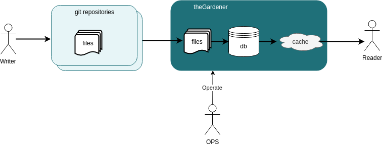

```thegardener
{
  "page" :
     {
        "label": "Operate theGardener",
        "description": "How to operate a theGardener instance ?"
     }
}
```

Once the instance is running, the OPS could need some tools to operate the application. Here are some tools. 



## Refresh data  

As there are several layers of data :
- the data in remote on the git repository
- the data stored on the file system in local
- the data in the database
- the data in cache

It might be useful to reset some data layer from its source. 

### API tools

#### Refresh menu from the database:

Compute the menu from the database and put it in the cache

```thegardener
{
  "scenarios" : 
     {
        "feature": "/administration/operation.feature",
        "select": { "tags" : ["@refresh_menu"]  }
     }
}
```      
   
#### Refresh one or all projects from the database:

- Compute all pages of all branches of the project from the database and put them in the cache 
- Compute the menu from the database and put it in the cache   


```thegardener
{
  "scenarios" : 
     {
        "feature": "/administration/operation.feature",
        "select": { "tags" : ["@refresh_project_from_db"]  }
     }
}
```   

#### Refresh one or all projects from the local files:

- Remove all branches, directories and pages of the project from the database
- Transform local files of the project into branches, directories and pages entities and store them in the database  
- Compute all pages of all branches of the project from the database and put them in the cache  
- Compute the menu from the database and put it in the cache   

```thegardener
{
  "scenarios" : 
     {
        "feature": "/administration/operation.feature",
        "select": { "tags" : ["@refresh_project_from_disk"]  }
     }
}
```


#### Synchronize one project from the remote git repository:

- Update all local files from the remote git repository
- Transform local files of the project into branches, directories and pages entities and update the related entities in the database  
- Compute all pages of all branches of the project from the database and put them in the cache  
- Compute the menu from the database and put it in the cache   

```thegardener
{
  "scenarios" : 
     {
        "feature": "/administration/operation.feature",
        "select": { "tags" : ["@synchronize_project_from_git"]  }
     }
}
```

#### Refresh one project from the remote git repository:

- Remove all branches, directories and pages of the project from the database
- Remove local files related to the project
- Checkout from scratch all branches of the project into the local file system
- Transform local files of the project into branches, directories and pages entities and store them in the database  
- Compute all pages of all branches of the project from the database and put them in the cache  
- Compute the menu from the database and put it in the cache   
 
```thegardener
{
  "scenarios" : 
     {
        "feature": "/administration/operation.feature",
        "select": { "tags" : ["@refresh_project_from_git"]  }
     }
}
``` 
 
 