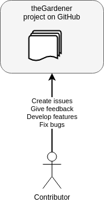

```thegardener
{
  "page" :
     {
        "label": "Contribute",
        "description": "Contribute to theGardener"
     }
}
```

theGardener is an open sourced project, it's there thank to the contributors. 



## Want to give feedback

Want to 

- Give feedback,
- Raise issues,
- Propose enhancement ? 

Please create an issue on https://github.com/KelkooGroup/theGardener/issues/new

## Want to talk to a human

Join us on [Discord](https://discordapp.com/channels/417704230531366923/417704230976225281) 

## Want to develop  

### Requirements 

You will need following tools to develop on theGardener project:

| Requirement       |     Version     |      Purpose     | 
| :------------     | :-------------: | :------------ |
| git               |     >= 2.20.0   | get the sources |
| java              |     >= 1.8.0    | run sbt and scala as theGardener run over Play/Scala  |
| sbt               |     > 1.3       | get Scala dependencies and run the Play server  |
| npm               |      >= 6.5.0   | get Angular dependencies  |
| Angular CLI (ng)  |      >= 7.3.8   | angular command line to serve the front end  |
| MySQL             |     ~ 8.0.?     | store and serve data |

Note that you can absolutely use a MySQL instance running inside Docker if you don't want to setup a MySQL instance on
your machine.

### Install a dev environment

#### Sources

Get sources:
```
git clone git@github.com:KelkooGroup/theGardener.git theGardener
```

#### Data

Create an empty directory _theGardener_git_data_ to store projects sources.

#### Init dababase

Create a database on mysql called _thegardener_.

#### Application.conf

Create a file _local-config/application.local.conf_ in theGardener sources to be able to store data in the local
directory and in the local database:
```
include "application.conf"

db.default.driver=com.mysql.cj.jdbc.Driver
db.default.url="jdbc:mysql://localhost:3306/thegardener?autoReconnect=true&useSSL=false&characterEncoding=utf8&useUnicode=true&useJDBCCompliantTimezoneShift=true&useLegacyDatetimeCode=false&serverTimezone=UTC"
db.default.username=root
db.default.password="somePassword"

projects.root.directory = "theGardener_git_data/"
projects.synchronize.interval = 86400
projects.synchronize.initial.delay = 10
```

#### Start the backend to apply database changes

Run the backend
```
sbt "~run -Dconfig.file=local-conf/application.local.conf"
```

Access to the Swagger doc : 
```
http://localhost:9000/api/docs
```

This will create the tables in the database
```
mysql> use thegardener ;
Database changed
mysql> show tables ;
+-----------------------+
| Tables_in_thegardener |
+-----------------------+
| branch                |
| feature               |
| feature_tag           |
| hierarchyNode         |
| play_evolutions       |
| project               |
| project_hierarchyNode |
| scenario              |
| scenario_tag          |
| tag                   |
+-----------------------+
10 rows in set (0.00 sec)
```

Stop the backend by killing the _sbt_ process.

#### Start 

Start the backend:
```
sbt "~run -Dconfig.file=local-conf/application.local.conf"
```

Start the frontend:
```
cd frontend
ng serve
```

##### Use the application 

Open [http://localhost:4200](http://localhost:4200)


##### Use the backend

Open [http://localhost:9000/api/docs](http://localhost:9000/api/docs)


### Development on Back

Know Play and Scala.

Before push:

```
sbt test
sbt scapegoat
```

### Development on Front

Know Angular.

The front is under _frontend_ directory.

Get Angular dependencies: 
```
cd frontend
npm install
```

Before push:

```
ng test
ng lint --fix
```


### Build and push a Docker image

As a theGardener developer you can build and push a Docker image of theGardener with
following commands.

#### Pre-requisites

_Please notet that we aim to smooth the build experience with a single command in the future._

As the frontend Angular build is not included in the sbt lifecycle for now, you have to run following
commands before building a Docker image:

```
cd frontend
npm install
npm run build-prod
rm -rf ../public/dist
cp -r dist ../public/dist
cd ..
```

This will build the Angular app and copy generated files in the `public` folder included in the 
backend build.

Then, run:

```
sbt clean stage
```

#### Build an image

```
sbt docker
```

This will build an image called `kelkoogroup/thegardener` with 2 tags: `latest` and
`X.Y.Z` where `X.Y.Z` is the version defined in the `version.sbt` file.

To build the image, we use the [sbt-docker](https://github.com/marcuslonnberg/sbt-docker)
plugin which allows the Docker build to be part of the sbt lifecycle. The Dockerfile is
defined in the `build.sbt` file within the following section:
```
dockerfile in docker := {
    new Dockerfile {
        ...
    }
}
```

#### Push an image

To be able to push, you need a Docker account allowed on the _kelkoogroup_ Docker Hub
organization and you need to login first with following command:

```
docker login
```

Then you can use one of those commands:

```
sbt dockerPush # If image already built
sbt dockerBuildAndPush # To build and push in one command
```

Note that pushing an image to Docker Hub can take few minutes.


