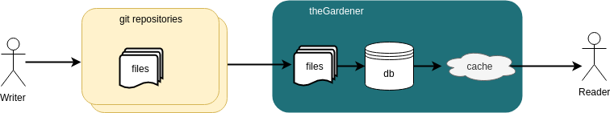

```thegardener
{
  "page" :
     {
        "label": "Project",
        "description": "What is this project ?"
     }
}
```


## Overview



## Main features

- Scan projects from git repositories
- Organize projects in a tree
- Organize documentation of a project with pages within directories
- Various features to help the developer in the documentation redaction

   - Support Markdown
   - Include Gherkin scenarios
   - Include OpenAPI models and endpoints
   - Include images
   - Externalize data by variables
   - Include external web pages
   - Preview on theGardener before merge 
     

## Open sourced

- [Apache License 2.0](https://github.com/KelkooGroup/theGardener/blob/master/LICENSE)
- [Sources](https://github.com/KelkooGroup/theGardener)
- [Milestones](https://github.com/KelkooGroup/theGardener/milestones?direction=asc&sort=title)
- [Kanban](https://github.com/KelkooGroup/theGardener/projects/1)
- [Issues](https://github.com/KelkooGroup/theGardener/issues)
- [Speak to a human](https://discordapp.com/channels/417704230531366923/417704230976225281)

## Technical stack

- On Front: TypeScript with Angular
- On Back: Scala with Play

## Original idea and main contributors

https://www.kelkoogroup.com/

## Prerequisite


 - **Use your favourite language** 
   - [Behavior Driven Development](https://cucumber.io/docs/bdd/) and [OpenAPI](https://swagger.io/docs/specification/about/) are not linked to a specific language
 - **Use git** 
   - theGardener scan only projects hosted on a git repository
 - **Use feature branching and merge requests**
   - Your documentation will be reviewed with a pair at the same time as the code: you will trust your documentation  
 - _(Optional but recommended)_ Write code with Behaviour Driven Development
   - It would help showing meaningful examples
 - _(Optional but recommended)_ On web services development, use OpenAPI format (For instance, use Swagger) 
   - It would avoid you copy past of model and endpoint descriptions


## Roots

- At [KelkooGroup](https://www.kelkoogroup.com/) we are intensively using the Behavior Driven Development to specify, develop and tests our applications.  We prefer talking about Specification by examples but BDD (Behavior Driven Development) name is more popular. There are many advantages to use this process :   

  - Enforce a close collaboration DEV / Product Owner
    - Use examples to open discussion and find many cases
    - Allows a very fast feedback loop
  - Functional tests
    - Fast and stable tests
    - The developer is guided, the code is pulled by the tests
    - Flexible code is required to mock external interactions
  - Runnable Documentation
    - Pulled from code, the documentation is always up to date
    - The documentation is exhaustive 

- So we have exhaustive and up to date documentation with all those scenarios. It used for the specification, the implementation and the regression tests. But we can do more with it: expose it the users of our applications.


- We have not found a proper tool to expose them, so we have started to build one.
- As we are using a lot of open source project/framework and libraries, we have decided to make it open source : https://github.com/KelkooGroup/theGardener.


Read [theGardener roots](assets/decks/src/theGardener_roots.pdf) for the full picture and a full example of user story written / implemented / tested with BDD.

    
## Plan

- Provide a good way to 
   - organize
   - navigate
   - write
   - search documentation. 
   
- Help the collaboration between the product owner and the dev team when it's time to write the gherkin scenario.


See [the detailed milestones](https://github.com/KelkooGroup/theGardener/milestones?direction=asc&sort=title&state=open)

 


