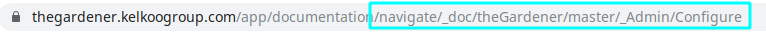

```thegardener
{
  "page" :
     {
        "label": "Improve",
        "description": "Improve the documentation"
     }
}
```


To **enrich the Markdown syntax**, several additional command can be applied. 

Those commands use the fact that Markdown syntax accept syntax highlighting: we will had a new language called _thegardener_ with a json format. 

**We will call refer to those kind of command as module.** 

_Trick: see the source of the current documentation by using **View source** button._  

## Define meta data

At the top of the page, add the following module :
  
````
```thegardener
{
  "page" :
     {
        "label": "Write documentation",
        "description": "How to write documentation with theGardener format ?"
     }
}
```
```` 

- page

   - label: define the text shown on the tab item
   - description: define the title of the page


## Define an internal link 

Be able to make link to pages in theGardener application.

**To a page in your project:**

Syntax of the link : usual [Markdown syntax](https://www.markdownguide.org/basic-syntax/#links).

For instance :
- [IncludeOpenApi](IncludeOpenApi.md)
- [IncludeOpenApi path section](./IncludeOpenApi.md#include-openapi-path)
- [Install](../Admin/Install.md)  


````
For instance :
- [IncludeOpenApi](./IncludeOpenApi.md)
- [IncludeOpenApi path section](./IncludeOpenApi.md#include-openapi-path)
- [Install](../Admin/Install.md)  
````

**To a page outside of your project:**



Copy past the url from 'navigate/' to the end of the url and use it to make the link with the following syntax :

Syntax of the link : thegardener://navigate/{hierarchy}/{project}/{branch}/{directories}/{page}{#anchor}

- only {hierarchy} is mandatory.
- for the branch, use '_' to access to the stable one.

For instance :
[theGardener adoption](thegardener://navigate/_doc/theGardener/master/_Admin/Configure)

````
[theGardener adoption](thegardener://navigate/_doc/theGardener/master/_Admin/Configure)
````

*Note: there are only one project here, but you got the idea.*

## Include external web page

This can be useful to include external pages. At the top of the markdown file, use this module :

````
```thegardener
{
  "includeExternalPage" : 
     {
        "url": "http://thegardener.kelkoogroup.net/api/docs/"
     }
}
```
````
 
This external web page will be display at the same place as the other pages. In other word, the text bellow this module will be ignored.  
  
Note that we can use the variables here :

````
```thegardener
{
  "includeExternalPage" : 
     {
        "url": "${swagger.url}/#"
     }
}
```
````


## Use variables

During the configuration of the project in theGardener, we can define variables at project level. This allow to externalise some values that we do not want to hard code in the documentation. For instance, server, urls... 
It can be useful to define swagger documentation urls for example.

For instance :
```json
[
  {"name" : "${swagger.url}", "value" : "http://thegardener.kelkoogroup.net/api/docs/"},
  {"name" : "${headline}" , "value" : "In our documentation we trust."}
]
```

Note: we do not assume of the format of the variable name: it's a simple replaceAll on the data. In the previous example => replace all `"${swagger.url}"` by `http://thegardener.kelkoogroup.net/api/docs/` in the text of all pages of the project.

Implicit variables that are always available :

- *project.current*: the current project name
- *branch.current*: the current branch name
- *branch.stable*: the stable branch name defined at project level

Note: don't forget to surround implicit variables by ${}


