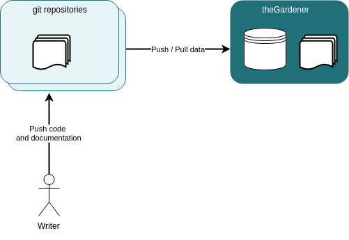

```thegardener
{
  "page" :
     {
        "label": "Getting started",
        "description": "Getting started to write documentation"
     }
}
```



**Write your documentation in your project source code in Markdown.** As MarkDown preview is embedded in any modern IDE, you will have an immediate preview , moreover if you push your current branch you will have easily a view of the output in theGardener application before even merging your code.


## Requirement

Your project need to be configured on theGardener instance : 

 - your project origin Git repository is well defined
 - your project is attached to a node of the hierarchy in order to be displayed at some point in the left menu
 - on the project level ,
 
   -  _documentationRootPath_ is defined 
 
Once this configuration done, you can apply the following format.

## Write simple documentation

### Directories and pages format 

The hierarchy of directories and pages is defined by one unique _thegardener.json_ file at each directory. 
The first _thegardener.json_ file expected by theGardener application is located in the directory referred by _documentationRootPath_ . 

For instance, for the project _myProject_

-  _documentationRootPath_ = /documentation

   - the file _myProject/documentation/thegardener.json_ should exists.

This file should have the following format :

```
{
  "directory" :
  {
    "label": "theGardener",
    "description": "In our documentation we trust.",
    "pages": [
      "why",
      "prerequisite",
      "changelog"
    ],
    "children" :[
      "guides"
    ]
  }
}
```

- directory

   - label: define the text shown on the menu item
   - description: define the tooltip of the menu item
   - pages: define the list of pages in order attached to this directory. 
   
      - Each directory has a list of pages that are displayed as tabs. The tabs respect the order of pages defined here.
      - In the example, _why_ refer to a file _why.md_ in the current directory.
      
   - children: define the list of sub directories in order attached to this directory.  
      
      - Each directory has a list of directories that are displayed as sub items in the menu. The sub items respect the order of children defined here.
      - In the example, _guides_ refer to a directory _guides_ in the current directory
      
         - a file _guides/thegardener.json_ should exists to define how to display the sub directory. This is a recursive structure.

See [the example](https://github.com/KelkooGroup/theGardener/blob/master/documentation/thegardener.json) in context.


### Page format 

The format of the page respect the [Markdown syntax](https://www.markdownguide.org/basic-syntax/).

Note: to be displayed in theGardener, the Markdown file need to have been listed in the _thegardener.json_ file of the current directory as explained above. 

To **enrich the Markdown syntax**, several additional command can be applied. Those commands use the fact that Markdown syntax accept syntax highlighting: we will had a new language called _thegardener_ with a json format. **We will call refer to those kind of command as module.** Make sure to use ``` before and after the command  (in the current documentation we are using ''' otherwise it would have been escapted at the rendering :) ). 

## Publish

Push the files to the git repository. 
- If the [webhook](../Admin/Configure.md) on the git repository is in place, the documentation is available right away.
- If not, theGardener instance will pull the changes at the next synchronization 
