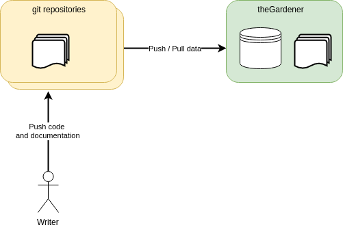
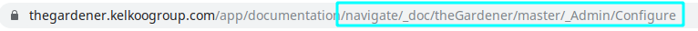
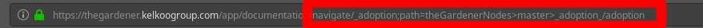

```thegardener
{
  "page" :
     {
        "label": "Write documentation",
        "description": "How to write documentation with theGardener format ?"
     }
}
```



**Write your documentation in your project source code in Markdown.** As MarkDown preview is embedded in any modern IDE, you will have an immediate preview , moreover if you push your current branch you will have easily a view of the output in theGardener application before even merging your code.


# Requirement


Your project need to be configured on theGardener instance : 

 - your project origin Git repository is well defined
 - your project is attached to a node of the hierarchy in order to be displayed at some point in the left menu
 - on the project level ,
 
   -  _documentationRootPath_ is defined 
 
Once this configuration done, you can apply the following format.

# Directories and pages format 

The hierarchy of directories and pages is defined by one unique _thegardener.json_ file at each directory. 
The first _thegardener.json_ file expected by theGardener application is located in the directory referred by _documentationRootPath_ . 

For instance, for the project _myProject_

-  _documentationRootPath_ = /documentation

   - the file _myProject/documentation/thegardener.json_ should exists.

This file should have the following format :

```
{
  "directory" :
  {
    "label": "theGardener",
    "description": "In our documentation we trust.",
    "pages": [
      "why",
      "prerequisite",
      "changelog"
    ],
    "children" :[
      "guides"
    ]
  }
}
```

- directory

   - label: define the text shown on the menu item
   - description: define the tooltip of the menu item
   - pages: define the list of pages in order attached to this directory. 
   
      - Each directory has a list of pages that are displayed as tabs. The tabs respect the order of pages defined here.
      - In the example, _why_ refer to a file _why.md_ in the current directory.
      
   - children: define the list of sub directories in order attached to this directory.  
      
      - Each directory has a list of directories that are displayed as sub items in the menu. The sub items respect the order of children defined here.
      - In the example, _guides_ refer to a directory _guides_ in the current directory
      
         - a file _guides/thegardener.json_ should exists to define how to display the sub directory. This is a recursive structure.

See [the example](https://github.com/KelkooGroup/theGardener/blob/master/documentation/thegardener.json) in context.


# Page format 

The format of the page respect the [Markdown syntax](https://guides.github.com/features/mastering-markdown/).

Note: to be displayed in theGardener, the Markdown file need to have been listed in the _thegardener.json_ file of the current directory as explained above. 

To **enrich the Markdown syntax**, several additional command can be applied. Those commands use the fact that Markdown syntax accept syntax highlighting: we will had a new language called _thegardener_ with a json format. **We will call refer to those kind of command as module.** Make sure to use ``` before and after the command  (in the current documentation we are using ''' otherwise it would have been escapted at the rendering :) ). 


## Define meta data

At the top of the page, add the following module :
  
````
```thegardener
{
  "page" :
     {
        "label": "Write documentation",
        "description": "How to write documentation with theGardener format ?"
     }
}
```
```` 

- page

   - label: define the text shown on the tab item
   - description: define the title of the page
 

See [the current page](https://github.com/KelkooGroup/theGardener/blob/master/documentation/guides/write.md) in context.


## Use variables

During the configuration of the project in theGardener, we can define variables at project level. This allow to externalise some values that we do not want to hard code in the documentation. For instance, server, urls... 
It can be useful to define swagger documentation urls for example.

For instance :
```json
[
  {"name" : "${swagger.url}", "value" : "http://thegardener.kelkoogroup.net/api/docs/"},
  {"name" : "${headline}" , "value" : "In our documentation we trust."}
]
```

Note: we do not assume of the format of the variable name: it a simple replaceAll in that data at display time of the page.

Implicit variables that are always available :

- *project.current*: the current project name
- *branch.current*: the current branch name
- *branch.stable*: the stable branch name defined at project level

Note: don't forget to surround implicit variables by ${}


This feature is explained by this specific scenario:
```thegardener
    {
      "scenarios" : 
         {
            "feature": "/documentation/page/show_a_page_with_variables.feature",
            "select": { "tags" : ["@nominal_case"]  }
         }
    }
```


## Define an internal link 

Be able to make link to pages in theGardener application.

See [the current page section](https://github.com/KelkooGroup/theGardener/blob/master/documentation/guides/write.md) in context.


**To a page under the same hierarchy node:**



Copy past the url from 'path=' to the end of the url and use it to make the link with the following syntax :

Syntax of the link : thegardener://path={project.id with front encoding}>{branch.name with front encoding}>{directory.path with front encoding}/{page.name}#anchor

For instance :
[internal link to installation guide of the project theGardener](thegardener://path=theGardener>master>_guides_/install)

````
[internal link to installation guide of the project theGardener](thegardener://path=theGardener>master>_guides_/install)
````

**To a page under another hierarchy node:**



Copy past the url from 'navigate/' to the end of the url and use it to make the link with the following syntax :

Syntax of the link : thegardener://navigate/{hierarchy path with front encoding};path={project.id with front encoding}>{branch.name with front encoding}>{directory.path with front encoding}/{page.name}#anchor

For instance :
[internal link to adoption path from another node in the hierarchy ](thegardener://navigate/_adoption;path=theGardenerNodes>master>_adoption_/adoption)

````
[internal link to adoption path from another node in the hierarchy ](thegardener://navigate/_adoption;path=theGardenerNodes>master>_adoption_/adoption)
````
Note: if branch.name isn't specified, it is considered to be the stable branch

### Anchors 

Click on the link sign next to titles to add the anchor to the url then make your internal link the same way as before

Example of a Link With Anchor : 
[internal link to the title Data of the installation guide of the project theGardener](thegardener://path=theGardener>master>_guides_/install#data)

## Include external web page

This can be useful to include the Swagger documentation. At the top of the markdown file, use this module :

````
```thegardener
{
  "includeExternalPage" : 
     {
        "url": "http://thegardener.kelkoogroup.net/api/docs/"
     }
}
```
````
 
This external web page will be display at the same place as the other pages. In other word, the text bellow this module will be ignored.  
  
Note that we can use the variables here :

````
```thegardener
{
  "includeExternalPage" : 
     {
        "url": "${swagger.url}/#"
     }
}
```
````

See [an example](https://github.com/KelkooGroup/theGardener/blob/master/documentation/api/tryit.md) in context.
  
  
## Include gherkin scenarios

**Some context**: The gherkin scenarios are really good to specify with the product owner what need to be implemented. 
The gherkin scenarios are living documentation and regression tests. 
There can be quite a lot of scenarios to cover all possible cases of all features. 
Usually, all the gherkin scenarios are needed for regression tests and when you want to dig on a very specific case BUT it can be quite difficult to understand them when you are not in the team. 
Only a few of them are meaningful for an external user who want to use your application. This is what will do here.
  
To include gherkin scenarios, use this module :

````
```thegardener
{
  "scenarios" : 
     {
        "feature": "/documentation/page/show_a_page_with_variables.feature",
        "select": { "tags" : ["@nominal_case"]  }
     }
}
```
```` 

Details on the settings :

- "project": this is the name of the project in theGardener. We can use "project": "." to select the current project or even remove the setting "project" : by default this will be the current project.
- "branch": branch selected to get the scenario.  If not defined, 
   - if the setting "project" refer to the current project : use the current branch
   - if the setting "project" do not refer to the current project : use the stable branch
- "feature": "/page/show_a_page_with_variables.feature", is the full path of the feature from the features directory of the project in theGardener. 
- "type" :  domain {"scenario","background"}, by default "scenario". 
   - if "type" is scenario, this is a selection of some scenarios in a feature
   - if "type" is background, this is a selection of the background in a feature
- "select": { tags : ["@nominal_case", "@level_1"]  } : this means to filter on scenario with @nominal_case AND @level_1 . Not used if the "type" is background.
- "includeBackground" : by default false. In case of scenario selection, include or not the background in the given step list.
 

See [the current page](https://github.com/KelkooGroup/theGardener/blob/master/documentation/guides/write.md) in context, there is an inclusion in the "Use variables" section.
