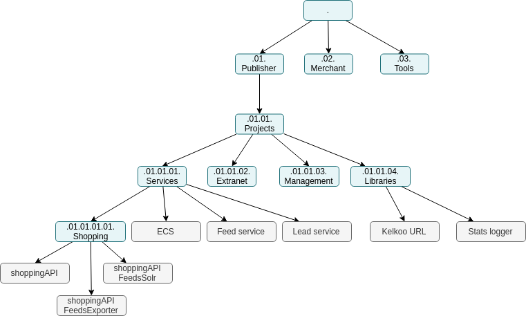

## Configure header

Some customization can be done on the header :

 - main logo
 - main title under the main logo 
 - icon on the web page
 - title of the web page
 
Those configuration are defined at application.conf level : 

```thegardener
    {
      "scenarios" :
         {
            "feature": "/administration/configuration.feature",
            "select": { "tags" : ["@documentation"]  }
         }
    }
```

## Configure the menu

Hierarchy, the projects and the links between them define the menu :




```thegardener
    {
      "scenarios" :
         {
            "feature": "/navigation/provide_menu.feature",
            "select": { "tags" : ["@documentation"]  }
         }
    }
```


