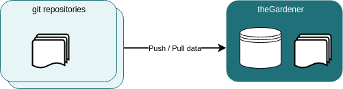

Markdown files, feature files, assets are synchronized from the git repositories either by a scheduler or by a web hook at git repository level, or both. 


```thegardener
    {
      "scenarios" :
         {
            "feature": "/synchronization/synchronize_resources.feature",
            "select": { "tags" : ["@documentation"]  }
         }
    }
```


Pages are computed when the synchronization from the remote server is done. The pages are always ready to be served :

```thegardener
    {
      "scenarios" :
         {
            "feature": "/synchronization/store_computed_pages_in_cache.feature",
            "select": { "tags" : ["@documentation"]  }
         }
    }
```
 

