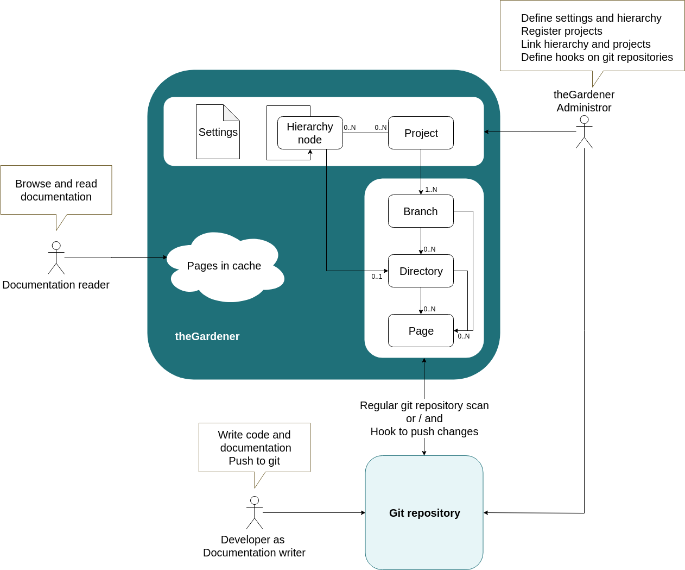

```thegardener
{
  "page" :
     {
        "label": "How does it work?",
        "description": "How does it work?"
     }
}
```




**theGardener** is highly customizable to adapt to your organization:

## Settings

Define:
- the logos
   - on the left top corner
   - on the browser window
- the titles:
   - under the left top corner logo
   - the window title
- the colors:
   - header
   - menu
   - text

We can define those different output:


                
          
## Hierarchy

The hierarchy is a tree of nodes that define:
- the headers: this is the first level of the tree
- for each header, the menu on the left: this is the sub tree
- for each node, we can link
   - some pages
   - some projects
   
The hierarchy can be as fat and as deep as needed.

Here is an example:    
   
   


## Project

- The project has **branches**. Those branches are the git branches of the project. We can choose by a regular expression which branches should appear: 

 

if only one branch is displayed, we do not show the branches level.

- **Directories** and **pages** under each project branch are defined by the developer in his/her source code.

- Each page is a markdown file.
 
  


## Publication

The publication of the documentation by the developer is done at the same time as its code: **the code and the documentation are at the same place.** 

So when, the developer commit and push it's code, he/her will ship the documentation as well.

The application theGardener scan from time to time the git repositories to synchronize it's representation. 

To speed up the publication, we can define **some web hooks** to publish right away the documentation.  


