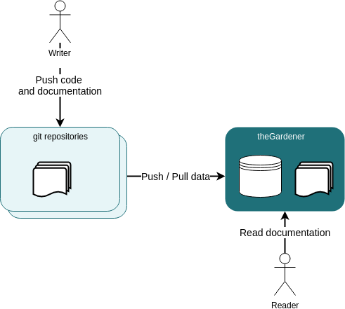

```thegardener
{
  "page" :
     {
        "label": "What is theGardener ?",
        "description": "What is theGardener ?"
     }
}
```


**theGardener** will help you to include the documentation in your development loop so that you will trust again the documentation you provide.


by 


