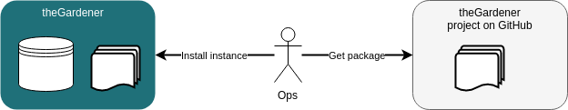

```thegardener
{
  "page" :
     {
        "label": "Install",
        "description": "How to install a new instance of theGardener ?"
     }
}
```

theGardener is an application that gather documentation from projects hosted on git repositories. 
This application need to be installed and configured. 




**DISCLAIMER**: this procedure help to install on a local workstation the application theGardener to be able test this project. This procedure will be replaced by proper process to use it in production : the goal of the milestone [M4 Packaging](https://github.com/KelkooGroup/theGardener/milestone/3) is to provide an easy way to deploy a packaged version of this application.

## Requirements 

| Requirement       |     Version     |      Purpose     | 
| :------------     | :-------------: | :------------ |
| git               |     >= 2.20.0   | get the sources |
| java              |     >= 1.8.0    | run sbt and scala as theGardener run over Play/Scala  |
| sbt               |     > 1.3       | get Scala dependencies and run the Play server  |
| npm               |      >= 6.5.0   | get Angular dependencies  |
| ng                |      >= 7.3.8   | angular command line to serve the front end  |
| mysql             |     ~ 8.0.?     | store and serve data |

## Prepare 

We assume we are in the directory ~.

### Get sources and dependencies

get sources :
```
git clone git@github.com:KelkooGroup/theGardener.git  theGardener
```

get Scala dependencies and compile Scala sources :
```
cd ~/theGardener
sbt compile 
```

get Angular dependencies 
```
cd ~/theGardener/frontend
npm install
```

### Data

Create an empty directory to store project source _~/theGardener_git_data_

### Application.conf

Add _~/theGardener/local-config/application.local.conf_ to be able to store data in the local directory and in the local database:
```
include "application.conf"

db.default.driver=com.mysql.cj.jdbc.Driver
db.default.url="jdbc:mysql://localhost:3306/thegardener?autoReconnect=true&useSSL=false&characterEncoding=utf8&useUnicode=true&useJDBCCompliantTimezoneShift=true&useLegacyDatetimeCode=false&serverTimezone=UTC"
db.default.username=root
db.default.password="5xdKVmt7guHMAcrd*"

projects.root.directory = "~/theGardener_git_data/"
projects.synchronize.interval = 86400
projects.synchronize.initial.delay = 10
```

### Init dababase

Create a database on mysql called _thegardener_.

#### Start the backend to apply database changes

Run the backend
```
cd ~/theGardener
sbt "~run -Dconfig.file=local-conf/application.local.conf"
```

Access to the Swagger doc : 
```
http://localhost:9000/api/docs
```

This will create the tables in the database
```
mysql> use thegardener ;
Database changed
mysql> show tables ;
+-----------------------+
| Tables_in_thegardener |
+-----------------------+
| branch                |
| feature               |
| feature_tag           |
| hierarchyNode         |
| play_evolutions       |
| project               |
| project_hierarchyNode |
| scenario              |
| scenario_tag          |
| tag                   |
+-----------------------+
10 rows in set (0.00 sec)
```

Stop the backend by kill the _sbt_ process

## Configure theGardener

**DISCLAIMER**: this procedure help to configure the application theGardener to be able test this project. This procedure will be replaced by a proper UI : the goal of the milestone [M3 Administration](https://github.com/KelkooGroup/theGardener/milestone/2) is to provide an easy way to configure the application.

The application store sources of projects hosted on git repository, we will use theGardener itself as an example :
```
mysql> INSERT INTO project (id, name, repositoryUrl, stableBranch, featuresRootPath) VALUES ('theGardener', 'theGardener', 'https://github.com/KelkooGroup/theGardener.git', 'master', 'test/features');
```
you can add any project you want here.

To access to those projects, you need to define a tree 
```
mysql> INSERT INTO hierarchyNode (id, slugName, name, childrenLabel, childLabel) VALUES ('.', 'root', 'root', 'Views', 'View');
mysql> INSERT INTO hierarchyNode (id, slugName, name, childrenLabel, childLabel) VALUES ('.01.', 'tools', 'Tools', 'Projects', 'Project');
```
The tree can be very large and deep, it depends on your needs. Every thing is based on the id, for instance you can have : 
* .
  * .01.
     * .01.01.
     * .01.02.
  * .02.
     * .02.01.

Then you associate the project to a node :

```
mysql> INSERT INTO project_hierarchyNode (projectId, hierarchyId) VALUES ('theGardener', '.01.');
```

## Start 

start the backend
```
cd ~/theGardener
sbt "~run -Dconfig.file=local-conf/application.local.conf"
```

start the frontend
```
cd ~/theGardener/frontend
ng serve
```

## Use 

### Use the application 

Open [http://localhost:4200](http://localhost:4200)


### Use the backend

Open [http://localhost:9000/api/docs](http://localhost:9000/api/docs)


