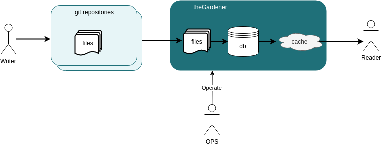

```thegardener
{
  "page" :
     {
        "label": "Operate",
        "description": "How to operate to theGardener instance ?"
     }
}
```

Once the instance is running, the OPS could need some tools to operate the application. Here are some tools. 




## Refresh data  

As there are several layers of data :
- the data in remote on the git repository
- the data stored on the file system in local
- the data in the database
- the data in cache

It might be useful to reset some data layer from its source. 

### API tools

- refresh menu from the database :

   - compute the menu from the database and put it in the cache
   
- refresh one or all projects from the database :

   - compute all pages of all branches of the project from the database and put them in the cache 
   - compute the menu from the database and put it in the cache   

- refresh one or all projects from the local files :

   - remove all branches, directories and pages of the project from the database
   - transform local files of the project into branches, directories and pages entities and store them in the database  
   - compute all pages of all branches of the project from the database and put them in the cache  
   - compute the menu from the database and put it in the cache   

- synchronize one project from the remote git repository :

   - update all local files from the remote git repository
   - transform local files of the project into branches, directories and pages entities and update the related entities in the database  
   - compute all pages of all branches of the project from the database and put them in the cache  
   - compute the menu from the database and put it in the cache   

- refresh one project from the remote git repository :

   - remove all branches, directories and pages of the project from the database
   - remove local files related to the project
   - checkout from scratch all branches of the project into the local file system
   - transform local files of the project into branches, directories and pages entities and store them in the database  
   - compute all pages of all branches of the project from the database and put them in the cache  
   - compute the menu from the database and put it in the cache   
 

### Specifications  
Here are some tools to refresh the data :

```thegardener
    {
      "scenarios" : 
         {
            "feature": "/administration/operation.feature",
            "select": { "tags" : ["@data_refresh"]  }
         }
    }
```