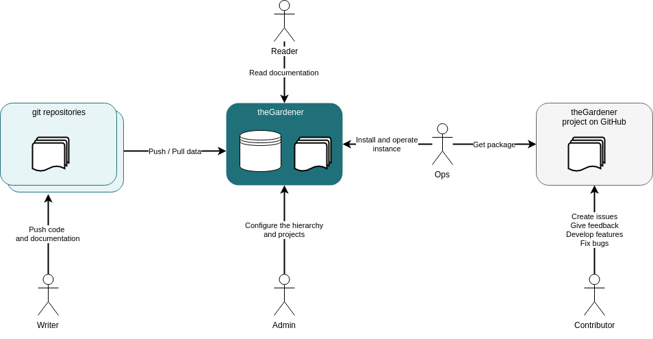

```thegardener
{
  "page" :
     {
        "label": "Roles",
        "description": "What are the different way to interact with theGardener ?"
     }
}
```


theGardener is an application that gather documentation from projects hosted on git repositories. This application need to be installed and configured. Then the developers of the different projects can start to write the documentation of there project in order to be accessible by users of their projects.

We can list several type of interaction with the application:     

- Install an instance of theGardener => theOPS 
- Configure an instance of theGardener => theAdmin
- Write documentation pushed to an instance of theGardener => theWriter 
- Read documentation proposed by of theGardener => theReader
- Contribute to theGardener development => theContributor


