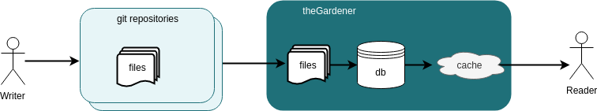

```thegardener
{
  "page" :
     {
        "label": "theProject",
        "description": "What is this project ?"
     }
}
```


## Overview



## Main features

- Scan projects from git repositories
- Organize projects in a tree
- Organize documentation of a project with pages within directories
- Various features to help the developer in the documentation redaction

   - Support Markdown
   - Include Gherkin scenarios
   - Include OpenAPI models and endpoints
   - Include images
   - Externalize data by variables
   - Include external web pages
   - Preview on theGardener before merge 
     

## Open sourced

- [Apache License 2.0](https://github.com/KelkooGroup/theGardener/blob/master/LICENSE)
- [Sources](https://github.com/KelkooGroup/theGardener)
- [Milestones](https://github.com/KelkooGroup/theGardener/milestones?direction=asc&sort=title)
- [Kanban](https://github.com/KelkooGroup/theGardener/projects/1)
- [Issues](https://github.com/KelkooGroup/theGardener/issues)
- [Speak to a human](https://discordapp.com/channels/417704230531366923/417704230976225281)

## Technical stack

- On Front: TypeScript with Angular
- On Back: Scala with Play

## Original idea and main contributors

https://www.kelkoogroup.com/
 


