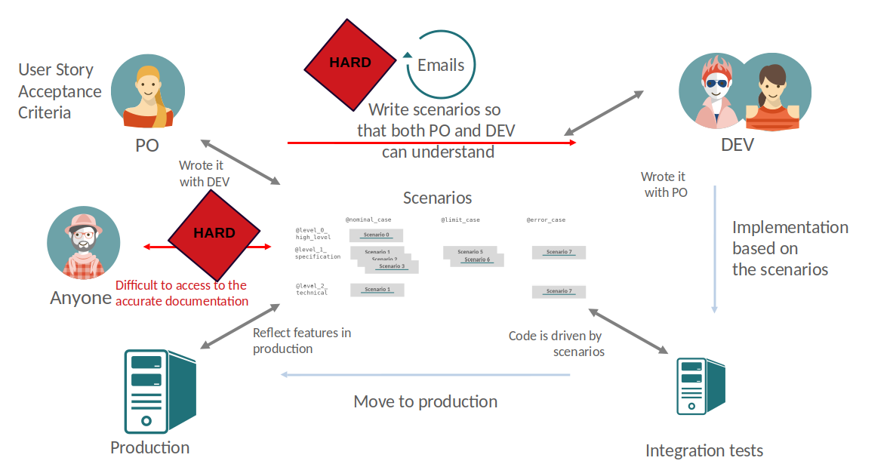

```thegardener
{
  "page" :
     {
        "label": "theRoots",
        "description": "In which context theGardener has started ?"
     }
}
```


## In a nutshell

- At [KelkooGroup](https://www.kelkoogroup.com/) we are intensively using the Behavior Driven Development to specify, develop and tests our applications.  We prefer talking about Specification by examples but BDD (Behavior Driven Development) name is more popular. There are many advantages to use this process :   

  - Enforce a close collaboration DEV / Product Owner
    - Use examples to open discussion and find many cases
    - Allows a very fast feedback loop
  - Functional tests
    - Fast and stable tests
    - The developer is guided, the code is pulled by the tests
    - Flexible code is required to mock external interactions
  - Runnable Documentation
    - Pulled from code, the documentation is always up to date
    - The documentation is exhaustive 

- So we have exhaustive and up to date documentation with all those scenarios. It used for the specification, the implementation and the regression tests. But we can do more with it: expose it the users of our applications.




- We have not found a proper tool to expose them, so we have started to build one.
- As we are using a lot of open source project/framework and libraries, we have decided to make it open source : https://github.com/KelkooGroup/theGardener.

## In details

Read [theGardener roots](assets/decks/theGardener_roots.pdf) for the full picture and a full example of user story written / implemented / tested with BDD.

    
