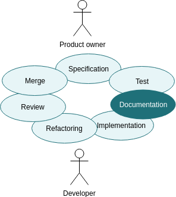

```thegardener
{
  "page" :
     {
        "label": "theTheaser",
        "description": "Why should I use theGardener?"
     }
}
```

# In our documentation we trust.

**We invite you to include the documentation writing task in the development loop.** You will trust again the technical documentation of your projects. With Test Driven Development, we have included the tests in the development loop and made the tests fun. With theGardener, you will include documentation writing in the development loop **and make it fun again**, if it has been ever fun.

## theProblem

Developer are lazy, that make them good developers. They are also bored to explain, by writing documentation, how to use the application they are developing. I know that because I'm a developer as well ;) At the end the technical documentation is written at the beginning of the project, when the developer have time or when somebody ask explicitly for it, remember they are lazy and bored... by the time the project is growing **the technical documentation is diverging from what it's actually doing. And nobody really trust the documentation written.**


## theContext

At some point, a long time ago, it was the same with tests : developer didn't want to write them as it was boring. With Test Driven Development, the test has been included in the development loop and the test became fun to write as much as it is really useful.

We can do the same with the documentation !




If the documentation writing task is included in the development loop, this task won't be forgotten. This task will be accurate as it will be reviewed with another developer during the merge request.

We can also make it less painful :

- usually to write documentation, the developer need to use another tool, he is not any more on his favourite IDE : there are some context switching between documentation and code, it's painful. As the documentation is not written by the same tool as the code, this step is either forgotten or done afterwards and most of the time never reviewed. **Imagine, writing the documentation inside your code base with an immediate preview** of the final output of the documentation. This documentation would be reviewed during the merge request as well as the code.  

- today, the Behaviour Driven Development is stating to be more and more used. The gherkin scenarios are really good to specify with the product owner what need to be implemented. The gherkin scenarios are living documentation and regression tests. There can be quite a lot of scenarios to cover all possible cases of all features. Usually, all the gherkin scenarios are needed for regression tests and when you want to dig on a very specific case BUT it can be quite difficult to understand them when you are not in the team. Only a few of them are meaningful for an external user who want to use your application. **So imagine that you can include exactly where you want the meaningful scenario in your documentation** without copy pasting anything and without repeat your self with what has been written in the BDD scenario, it would be less painful :)

- today, on a web service development, there is a common standard that start to be more and more used : OpenAPI documentation format. The main library that generate this kind of format is Swagger. **Imagine that you could easily include in your documentation any model description, any endpoint description without copy pasting anything** and without repeat your self with the code you have written, **it would be less painful :)**    


## theSolution

Start using theGardener ! It allow you to :

 - **Write your documentation in your project source code in Markdown.** As MarkDown preview is embedded in any modern IDE, you will have an immediate preview , moreover if you push your current branch you will have easily a view of the output in theGardener application before even merging your code.
 - **Organize your documentation** in your project with as many pages and sub directories you need.  
 - Organize your documentation across a very large number of projects by allowing the access to the project through a tree that can be as large and as fat as you need.
 - **Include only the meaningful gherkin scenario** exactly where you want in your documentation.
 - **Include OpenAPI model and endpoint description** exactly where you want in your documentation.


